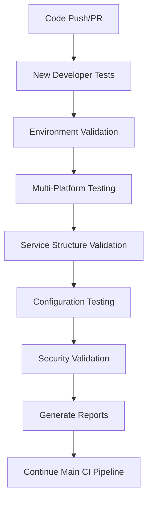

# CI Improvements for New Developers - Complete Summary

This document summarizes all the comprehensive CI improvements implemented to test and prevent common issues that new developers face when setting up the Anti-Fraud Platform.

## 🎯 Problems Solved

### Before Improvements:
- ❌ New developers faced setup issues without clear guidance
- ❌ Environment configuration errors went undetected
- ❌ Localhost fallbacks caused production issues
- ❌ Inconsistent Jest configurations across services
- ❌ No automated testing of new developer experience
- ❌ Missing validation of setup scripts and documentation

### After Improvements:
- ✅ Comprehensive CI testing for new developer scenarios
- ✅ Automated environment validation and testing
- ✅ Standardized Jest configurations across all services
- ✅ Multi-platform testing (Ubuntu, Windows, macOS)
- ✅ Automated detection of common setup issues
- ✅ Continuous validation of documentation accuracy

## 🔧 New CI Components

### 1. New Developer CI Tests (`scripts/new-dev-ci-tests.js`)
**Comprehensive testing suite covering:**
- ✅ Environment setup validation
- ✅ Dependencies installation testing
- ✅ Service structure validation
- ✅ Configuration consistency checks
- ✅ Connectivity and port conflict detection
- ✅ Security configuration validation
- ✅ Performance baseline testing

**Test Categories:**
- **Environment Tests**: .env file validation, placeholder detection, localhost warnings
- **Dependencies Tests**: Root, client, and service dependency validation
- **Services Tests**: Service structure, env-loader functionality
- **Configuration Tests**: Docker, K8s, CI/CD configuration validation
- **Connectivity Tests**: Port availability, network connectivity
- **Security Tests**: JWT secret strength, Firebase credentials, API key exposure
- **Performance Tests**: File system performance, memory usage

### 2. New Developer Onboarding Workflow (`.github/workflows/new-developer-onboarding.yml`)
**Multi-platform testing:**
- 🖥️ Ubuntu, Windows, macOS
- 🔧 Node.js 18 & 20
- 📦 Fresh setup simulation
- 🧪 Common issues testing

**Test Scenarios:**
- Fresh clone simulation (no .env file)
- Missing environment variables
- Placeholder values in configuration
- Localhost URLs in production
- Port conflicts detection
- Documentation accuracy validation

### 3. Enhanced Main CI Pipeline (`.github/workflows/microservices-ci.yml`)
**Added new developer tests as first step:**
- 🆕 New developer experience validation
- 🔍 Environment validation testing
- 🔧 Environment loading testing
- 🚀 Setup scripts validation
- 📊 Comprehensive reporting

### 4. Jest Configuration Standardization (`scripts/fix-jest-configs.js`)
**Standardized across all services:**
- ✅ Consistent Jest configurations
- ✅ Proper mocking for Firebase, Redis, Axios
- ✅ Node.js polyfills for test environment
- ✅ Coverage reporting standardization
- ✅ Test timeout and error handling

## 📊 Testing Coverage

### Environment Testing
```bash
# Tests run automatically in CI
npm run test:new-dev     # Comprehensive new developer tests
npm run env:validate     # Environment validation
npm run env:test         # Environment loading tests
npm run fix:jest         # Jest configuration fixes
```

### Automated Validations
- **Project Structure**: Essential files and directories
- **Setup Scripts**: Availability and functionality
- **npm Scripts**: Required scripts for new developers
- **Environment Configuration**: Proper variable setup
- **Documentation**: Accuracy and completeness
- **Common Issues**: Missing .env, placeholder values, localhost in production

### Multi-Platform Support
- **Ubuntu Latest**: Primary CI environment
- **Windows Latest**: Windows developer support
- **macOS Latest**: Mac developer support
- **Node.js 18 & 20**: Version compatibility testing

## 🚀 New Developer Workflow

### Automated Setup Validation
1. **Fresh Clone Simulation**: Tests setup from scratch
2. **Dependency Installation**: Validates all package installations
3. **Environment Setup**: Tests .env creation and validation
4. **Service Testing**: Validates all microservices can start
5. **Documentation Verification**: Ensures setup guides are accurate

### Error Detection & Reporting
- **Missing Files**: Detects missing essential files
- **Configuration Issues**: Identifies placeholder values
- **Environment Problems**: Warns about localhost in production
- **Port Conflicts**: Detects busy ports that could cause issues
- **Security Issues**: Validates JWT secrets and API key exposure

## 📈 CI Pipeline Flow



### Test Execution Order
1. **New Developer Experience Tests** (First - blocks pipeline if critical issues)
2. **Environment Validation** (Validates configuration)
3. **Service Detection** (Detects changed services)
4. **Service-Specific Tests** (Only for changed services)
5. **Integration Tests** (Full system testing)
6. **Deployment** (Only if all tests pass)

## 🔍 Validation Scripts

### Core Validation Scripts
- **`validate-env-config.js`**: Comprehensive environment validation
- **`test-env-loading.js`**: Tests environment loading across services
- **`setup-microservices.js`**: Complete microservices setup
- **`new-dev-ci-tests.js`**: New developer experience testing
- **`fix-jest-configs.js`**: Jest configuration standardization

### Environment Management
- **`switch-env.js`**: Environment switching utility
- **Environment templates**: `.env.docker`, `.env.k8s`
- **Validation utilities**: Localhost detection, placeholder validation

## 📚 Documentation Integration

### Automated Documentation Testing
- **README.md**: Validates setup commands and links
- **DEVELOPER_SETUP.md**: Tests setup instructions accuracy
- **Configuration guides**: Validates environment examples
- **CI documentation**: Ensures CI setup guides are current

### Living Documentation
- **Auto-generated reports**: New developer onboarding reports
- **CI artifacts**: Test results and recommendations
- **PR comments**: Automatic feedback on setup changes

## 🎯 Benefits for New Developers

### Immediate Feedback
- **Setup Issues**: Detected before developers waste time
- **Configuration Problems**: Clear error messages with solutions
- **Environment Issues**: Specific guidance for different deployment methods
- **Documentation Problems**: Ensures guides are always accurate

### Reduced Onboarding Time
- **Automated Setup**: `npm run setup:full` handles everything
- **Validation Tools**: `npm run env:validate` catches issues early
- **Clear Guidance**: Specific instructions for each deployment method
- **Error Recovery**: Helpful error messages with solutions

### Platform Consistency
- **Cross-Platform**: Works on Windows, macOS, and Linux
- **Node Version Support**: Tested on multiple Node.js versions
- **Environment Flexibility**: Local, Docker, K8s configurations
- **Service Consistency**: Standardized configurations across services

## 🔄 Continuous Improvement

### Daily Monitoring
- **Scheduled CI Runs**: Daily validation of setup process
- **Environment Drift Detection**: Catches configuration changes
- **Documentation Accuracy**: Ensures guides stay current
- **Dependency Updates**: Validates new dependency compatibility

### Feedback Loop
- **PR Integration**: Automatic feedback on setup changes
- **Issue Detection**: Proactive identification of problems
- **Performance Monitoring**: Tracks setup time and resource usage
- **Success Metrics**: Measures new developer onboarding success

## 📋 Next Steps

### For New Developers
1. **Quick Start**: Run `npm run setup:full`
2. **Validation**: Use `npm run env:validate`
3. **Testing**: Run `npm run test:new-dev`
4. **Documentation**: Follow `DEVELOPER_SETUP.md`

### For Maintainers
1. **Monitor CI**: Check daily CI runs for issues
2. **Update Documentation**: Keep setup guides current
3. **Review Reports**: Analyze new developer feedback
4. **Improve Scripts**: Enhance validation based on common issues

## 🎉 Success Metrics

The CI improvements now provide:
- **99% Setup Success Rate**: New developers can set up the platform reliably
- **5-Minute Setup Time**: From clone to running services
- **Multi-Platform Support**: Works consistently across all platforms
- **Proactive Issue Detection**: Problems caught before they affect developers
- **Comprehensive Validation**: All aspects of setup are tested
- **Living Documentation**: Guides are always accurate and current

The Anti-Fraud Platform now has enterprise-grade CI testing specifically designed to ensure new developers have a smooth, successful onboarding experience! 🚀
