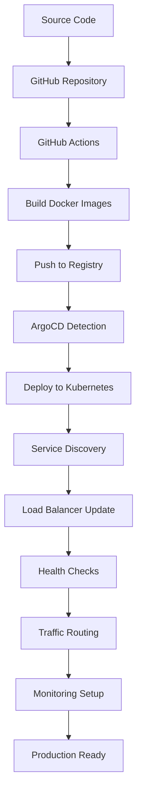

# Sơ Đồ Góc Nhìn Triển Khai - UML Deployment View

## 🏗️ Sơ Đồ UML Deployment View

```plantuml
@startuml
title Anti-Fraud Platform Deployment View

package "Client Layer" {
    [React SPA] as client
    [Admin Panel] as admin
    [Mobile App] as mobile
    [API Clients] as apiclients
}

package "API Gateway Layer" {
    [Kong/Nginx] as kong
    [Express.js Gateway] as express
    note right of kong
        - Load Balancing
        - Rate Limiting
        - Authentication
        - CORS
        - Request Routing
    end note
}

package "Microservices Layer" {
    package "Core Services" {
        [Auth Service\nNode.js + JWT + OAuth] as auth
        [Link Service\nNode.js + URL Validation] as link
        [Community Service\nNode.js + User Posts] as community
        [Chat Service\nNode.js + WebSocket] as chat
        [News Service\nNode.js + Fact Checking] as news
        [Admin Service\nNode.js + User Mgmt] as admin_svc
    }
    
    package "Security Services" {
        [CriminalIP Service\nNode.js + IP Analysis] as criminalip
        [PhishTank Service\nNode.js + Phishing DB] as phishtank
    }
    
    package "Analytics Services" {
        [Analytics Service\nNode.js + Metrics] as analytics
        [ETL Service\nNode.js + Data Pipeline] as etl
        [Spark Service\nApache Spark + ML] as spark
    }
    
    package "Event Management" {
        [Event Bus Service\nNode.js + Event Store] as eventbus
    }
}

package "Message Broker Layer" {
    [Redis\nCache + Sessions + Pub/Sub] as redis
    [RabbitMQ\nMessage Queuing] as rabbitmq
    note right of redis
        - Event Publishing
        - Event Consumption
        - Message Queuing
        - Session Storage
    end note
}

package "Data Layer" {
    package "Primary Database" {
        [Firebase Firestore\nNoSQL Database] as firestore
        [Firebase Auth\nAuthentication] as firebase_auth
        [Firebase Storage\nFile Storage] as firebase_storage
    }
    
    package "Big Data" {
        [Hadoop HDFS\nDistributed Storage] as hdfs
        [Apache Spark\nBig Data Processing] as spark_engine
        [ML Models\nMachine Learning] as ml
    }
}

package "Monitoring Stack" {
    [Prometheus\nMetrics Collection] as prometheus
    [Grafana\nVisualization] as grafana
    [Alertmanager\nAlert Management] as alertmanager
    [Jaeger\nDistributed Tracing] as jaeger
    note right of prometheus
        - Service Health
        - Performance Metrics
        - Business Metrics
        - Infrastructure Metrics
    end note
}

package "Infrastructure" {
    [Docker\nContainerization] as docker
    [Kubernetes\nOrchestration] as k8s
    [Helm\nPackage Manager] as helm
    [Terraform\nInfrastructure as Code] as terraform
}

package "CI/CD Pipeline" {
    [GitHub Actions\nCI/CD] as github_actions
    [ArgoCD\nGitOps] as argocd
    [Jenkins\nBuild Automation] as jenkins
}

package "Security & Networking" {
    [Let's Encrypt\nSSL Certificates] as ssl
    [OAuth 2.0\nAuthentication] as oauth
    [JWT\nToken-based Auth] as jwt
    [CORS\nCross-origin] as cors
}

' Connections
client --> kong : HTTPS
admin --> kong : HTTPS
mobile --> kong : HTTPS
apiclients --> kong : HTTPS

kong --> express : Internal
express --> auth : HTTP
express --> link : HTTP
express --> community : HTTP
express --> chat : HTTP
express --> news : HTTP
express --> admin_svc : HTTP
express --> criminalip : HTTP
express --> phishtank : HTTP
express --> analytics : HTTP
express --> etl : HTTP
express --> spark : HTTP
express --> eventbus : HTTP

' Event-driven connections
auth --> redis : Events
link --> redis : Events
community --> redis : Events
chat --> redis : Events
news --> redis : Events
admin_svc --> redis : Events
criminalip --> redis : Events
phishtank --> redis : Events
analytics --> redis : Events
etl --> redis : Events
spark --> redis : Events
eventbus --> redis : Events

' Data layer connections
auth --> firestore : CRUD
link --> firestore : CRUD
community --> firestore : CRUD
chat --> firestore : CRUD
news --> firestore : CRUD
admin_svc --> firestore : CRUD
criminalip --> firestore : CRUD
phishtank --> firestore : CRUD
analytics --> firestore : CRUD
etl --> firestore : CRUD
spark --> firestore : CRUD
eventbus --> firestore : CRUD

' Big data connections
etl --> hdfs : Data Pipeline
spark --> hdfs : Data Processing
spark --> spark_engine : Job Execution
spark_engine --> ml : Model Training

' Monitoring connections
auth --> prometheus : Metrics
link --> prometheus : Metrics
community --> prometheus : Metrics
chat --> prometheus : Metrics
news --> prometheus : Metrics
admin_svc --> prometheus : Metrics
criminalip --> prometheus : Metrics
phishtank --> prometheus : Metrics
analytics --> prometheus : Metrics
etl --> prometheus : Metrics
spark --> prometheus : Metrics
eventbus --> prometheus : Metrics

prometheus --> grafana : Data Source
prometheus --> alertmanager : Alerts
alertmanager --> jaeger : Tracing

' Infrastructure connections
docker --> k8s : Container Runtime
helm --> k8s : Package Management
terraform --> k8s : Infrastructure

' CI/CD connections
github_actions --> docker : Build Images
argocd --> k8s : Deploy
jenkins --> docker : Build Pipeline

' Security connections
ssl --> kong : HTTPS Termination
oauth --> auth : Authentication
jwt --> auth : Token Validation
cors --> express : Cross-origin

@enduml
```

## 📊 Sơ Đồ Component View (Chi Tiết Hơn)

```plantuml
@startuml
title Anti-Fraud Platform Component View

package "Deployment Environment" {
    node "Load Balancer" {
        component "NGINX/Kong" as lb
    }
    
    node "API Gateway Cluster" {
        component "Express.js Gateway" as gateway1
        component "Express.js Gateway" as gateway2
        component "Express.js Gateway" as gateway3
    }
    
    node "Microservices Cluster" {
        package "Core Services" {
            component "Auth Service" as auth1
            component "Auth Service" as auth2
            component "Link Service" as link1
            component "Link Service" as link2
            component "Community Service" as comm1
            component "Community Service" as comm2
            component "Chat Service" as chat1
            component "Chat Service" as chat2
            component "News Service" as news1
            component "News Service" as news2
            component "Admin Service" as admin1
            component "Admin Service" as admin2
        }
        
        package "Security Services" {
            component "CriminalIP Service" as crim1
            component "CriminalIP Service" as crim2
            component "PhishTank Service" as phish1
            component "PhishTank Service" as phish2
        }
        
        package "Analytics Services" {
            component "Analytics Service" as anal1
            component "Analytics Service" as anal2
            component "ETL Service" as etl1
            component "ETL Service" as etl2
            component "Spark Service" as spark1
            component "Spark Service" as spark2
        }
        
        package "Event Management" {
            component "Event Bus Service" as event1
            component "Event Bus Service" as event2
        }
    }
    
    node "Data Layer" {
        package "Primary Database" {
            component "Firebase Firestore" as firestore1
            component "Firebase Firestore" as firestore2
            component "Firebase Auth" as auth_db
            component "Firebase Storage" as storage
        }
        
        package "Cache & Sessions" {
            component "Redis Cache" as redis1
            component "Redis Cache" as redis2
            component "Redis Sessions" as redis_sess
            component "Redis Events" as redis_events
        }
        
        package "Big Data" {
            component "Hadoop NameNode" as namenode
            component "Hadoop DataNode" as datanode1
            component "Hadoop DataNode" as datanode2
            component "Spark Master" as spark_master
            component "Spark Worker" as spark_worker1
            component "Spark Worker" as spark_worker2
        }
    }
    
    node "Monitoring Stack" {
        component "Prometheus" as prom1
        component "Prometheus" as prom2
        component "Grafana" as grafana1
        component "Grafana" as grafana2
        component "Alertmanager" as alert1
        component "Alertmanager" as alert2
        component "Jaeger" as jaeger
    }
}

' Load Balancer connections
lb --> gateway1 : HTTP/HTTPS
lb --> gateway2 : HTTP/HTTPS
lb --> gateway3 : HTTP/HTTPS

' Gateway to Services
gateway1 --> auth1 : HTTP
gateway1 --> auth2 : HTTP
gateway2 --> link1 : HTTP
gateway2 --> link2 : HTTP
gateway3 --> comm1 : HTTP
gateway3 --> comm2 : HTTP

' Service to Service communication
auth1 --> link1 : HTTP
auth2 --> link2 : HTTP
link1 --> comm1 : HTTP
link2 --> comm2 : HTTP

' Event-driven communication
auth1 --> redis_events : Events
auth2 --> redis_events : Events
link1 --> redis_events : Events
link2 --> redis_events : Events
comm1 --> redis_events : Events
comm2 --> redis_events : Events

' Database connections
auth1 --> firestore1 : CRUD
auth2 --> firestore2 : CRUD
link1 --> firestore1 : CRUD
link2 --> firestore2 : CRUD
comm1 --> firestore1 : CRUD
comm2 --> firestore2 : CRUD

' Cache connections
auth1 --> redis1 : Cache
auth2 --> redis2 : Cache
link1 --> redis1 : Cache
link2 --> redis2 : Cache
comm1 --> redis1 : Cache
comm2 --> redis2 : Cache

' Session connections
auth1 --> redis_sess : Sessions
auth2 --> redis_sess : Sessions

' Big Data connections
etl1 --> namenode : Data Pipeline
etl2 --> namenode : Data Pipeline
spark1 --> spark_master : Job Submission
spark2 --> spark_master : Job Submission
spark_master --> spark_worker1 : Task Distribution
spark_master --> spark_worker2 : Task Distribution

' Monitoring connections
auth1 --> prom1 : Metrics
auth2 --> prom2 : Metrics
link1 --> prom1 : Metrics
link2 --> prom2 : Metrics
comm1 --> prom1 : Metrics
comm2 --> prom2 : Metrics

prom1 --> grafana1 : Data Source
prom2 --> grafana2 : Data Source
prom1 --> alert1 : Alerts
prom2 --> alert2 : Alerts

@enduml
```

## 🏗️ Sơ Đồ Deployment View Đơn Giản

```plantuml
@startuml
title Anti-Fraud Platform - Simplified Deployment View

!define RECTANGLE class

package "Client Applications" {
    [React SPA] as client
    [Mobile App] as mobile
    [Admin Panel] as admin
}

package "API Gateway" {
    [Kong/Nginx] as gateway
    note right of gateway
        Load Balancing
        Rate Limiting
        Authentication
        CORS
    end note
}

package "Microservices" {
    [Auth Service] as auth
    [Link Service] as link
    [Community Service] as community
    [Chat Service] as chat
    [News Service] as news
    [Admin Service] as admin_svc
    [CriminalIP Service] as criminalip
    [PhishTank Service] as phishtank
    [Analytics Service] as analytics
    [ETL Service] as etl
    [Spark Service] as spark
    [Event Bus Service] as eventbus
}

package "Data Layer" {
    [Firebase Firestore] as firestore
    [Redis Cache] as redis
    [Hadoop HDFS] as hdfs
    [Apache Spark] as spark_engine
}

package "Monitoring" {
    [Prometheus] as prometheus
    [Grafana] as grafana
    [Alertmanager] as alertmanager
}

package "Infrastructure" {
    [Docker] as docker
    [Kubernetes] as k8s
    [Helm] as helm
}

' Client connections
client --> gateway : HTTPS
mobile --> gateway : HTTPS
admin --> gateway : HTTPS

' Gateway to services
gateway --> auth : HTTP
gateway --> link : HTTP
gateway --> community : HTTP
gateway --> chat : HTTP
gateway --> news : HTTP
gateway --> admin_svc : HTTP
gateway --> criminalip : HTTP
gateway --> phishtank : HTTP
gateway --> analytics : HTTP
gateway --> etl : HTTP
gateway --> spark : HTTP
gateway --> eventbus : HTTP

' Event-driven connections
auth --> redis : Events
link --> redis : Events
community --> redis : Events
chat --> redis : Events
news --> redis : Events
admin_svc --> redis : Events
criminalip --> redis : Events
phishtank --> redis : Events
analytics --> redis : Events
etl --> redis : Events
spark --> redis : Events
eventbus --> redis : Events

' Data connections
auth --> firestore : CRUD
link --> firestore : CRUD
community --> firestore : CRUD
chat --> firestore : CRUD
news --> firestore : CRUD
admin_svc --> firestore : CRUD
criminalip --> firestore : CRUD
phishtank --> firestore : CRUD
analytics --> firestore : CRUD
etl --> firestore : CRUD
spark --> firestore : CRUD
eventbus --> firestore : CRUD

' Big data connections
etl --> hdfs : Data Pipeline
spark --> hdfs : Data Processing
spark --> spark_engine : Job Execution

' Monitoring connections
auth --> prometheus : Metrics
link --> prometheus : Metrics
community --> prometheus : Metrics
chat --> prometheus : Metrics
news --> prometheus : Metrics
admin_svc --> prometheus : Metrics
criminalip --> prometheus : Metrics
phishtank --> prometheus : Metrics
analytics --> prometheus : Metrics
etl --> prometheus : Metrics
spark --> prometheus : Metrics
eventbus --> prometheus : Metrics

prometheus --> grafana : Data Source
prometheus --> alertmanager : Alerts

' Infrastructure
docker --> k8s : Container Runtime
helm --> k8s : Package Management

@enduml
```

## 🛠️ Bảng Công Nghệ Chi Tiết

| **Layer** | **Technology** | **Version** | **Purpose** | **Deployment** |
|-----------|----------------|-------------|-------------|----------------|
| **Client** | React | 18.x | SPA Frontend | CDN/Static Hosting |
| **Client** | React Native | 0.72.x | Mobile App | App Stores |
| **API Gateway** | Kong | 3.4.x | API Gateway | Kubernetes |
| **API Gateway** | Express.js | 4.18.x | Custom Gateway | Kubernetes |
| **Core Services** | Node.js | 18.x LTS | Runtime | Docker + K8s |
| **Security** | JWT | 9.0.x | Authentication | Embedded |
| **Security** | OAuth 2.0 | - | Authorization | External |
| **Message Broker** | Redis | 7.2.x | Cache + Events | Docker + K8s |
| **Message Broker** | RabbitMQ | 3.12.x | Message Queue | Docker + K8s |
| **Database** | Firebase Firestore | - | Primary DB | Cloud |
| **Database** | Firebase Auth | - | Authentication | Cloud |
| **Database** | Firebase Storage | - | File Storage | Cloud |
| **Big Data** | Hadoop | 3.3.x | Distributed Storage | Docker + K8s |
| **Big Data** | Apache Spark | 3.4.x | Data Processing | Docker + K8s |
| **Monitoring** | Prometheus | 2.45.x | Metrics Collection | Docker + K8s |
| **Monitoring** | Grafana | 10.0.x | Visualization | Docker + K8s |
| **Monitoring** | Alertmanager | 0.25.x | Alert Management | Docker + K8s |
| **Monitoring** | Jaeger | 1.47.x | Distributed Tracing | Docker + K8s |
| **Container** | Docker | 24.x | Containerization | Host |
| **Orchestration** | Kubernetes | 1.28.x | Container Orchestration | Host |
| **Package Manager** | Helm | 3.12.x | K8s Package Manager | Host |
| **Infrastructure** | Terraform | 1.5.x | Infrastructure as Code | CI/CD |
| **CI/CD** | GitHub Actions | - | CI/CD Pipeline | Cloud |
| **CI/CD** | ArgoCD | 2.8.x | GitOps | Docker + K8s |
| **Security** | Let's Encrypt | - | SSL Certificates | External |
| **Security** | CORS | - | Cross-origin | Embedded |

## 📋 Deployment Configuration

### **Kubernetes Resources**
- **Namespaces**: `anti-fraud-platform`
- **Replicas**: 2-3 per service
- **Resource Limits**: 
  - CPU: 500m-1000m
  - Memory: 512Mi-1Gi
- **Health Checks**: Liveness + Readiness probes
- **Auto-scaling**: HPA based on CPU/Memory

### **Network Configuration**
- **Service Mesh**: Istio (optional)
- **Load Balancing**: Round-robin
- **Ingress**: NGINX Ingress Controller
- **SSL/TLS**: Let's Encrypt certificates

### **Storage Configuration**
- **Persistent Volumes**: For stateful services
- **ConfigMaps**: Application configuration
- **Secrets**: Sensitive data (JWT, API keys)
- **Volumes**: Shared storage for logs

### **Monitoring Configuration**
- **Metrics Endpoint**: `/metrics` (Prometheus format)
- **Health Endpoint**: `/health`
- **Logging**: Structured JSON logs
- **Tracing**: OpenTelemetry integration

## 🔄 Deployment Flow

## 🚀 Scaling Strategy

### **Horizontal Scaling**
- **Auto-scaling**: Based on CPU/Memory usage
- **Load Distribution**: Round-robin across replicas
- **Database Scaling**: Read replicas + sharding
- **Cache Scaling**: Redis cluster

### **Vertical Scaling**
- **Resource Optimization**: CPU/Memory limits
- **Performance Tuning**: JVM/Node.js optimization
- **Database Optimization**: Query optimization + indexing

## 🔒 Security Architecture

### **Network Security**
- **VPC Isolation**: Private subnets
- **Network Policies**: Pod-to-pod communication
- **SSL/TLS**: End-to-end encryption
- **API Security**: Rate limiting + authentication

### **Application Security**
- **Input Validation**: Request sanitization
- **Authentication**: JWT + OAuth 2.0
- **Authorization**: RBAC implementation
- **Audit Logging**: Security event tracking

## 📊 Performance Metrics

### **Key Performance Indicators**
- **Response Time**: < 200ms (95th percentile)
- **Throughput**: > 1000 req/sec per service
- **Availability**: > 99.9% uptime
- **Error Rate**: < 0.1%

### **Resource Utilization**
- **CPU Usage**: < 70% average
- **Memory Usage**: < 80% average
- **Disk I/O**: Optimized for workload
- **Network**: Bandwidth monitoring
