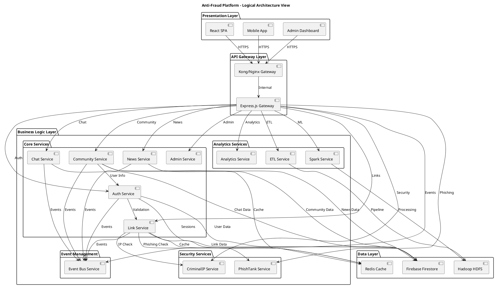
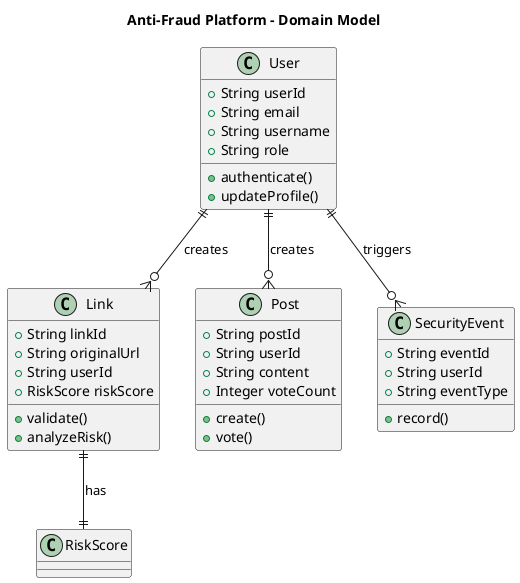
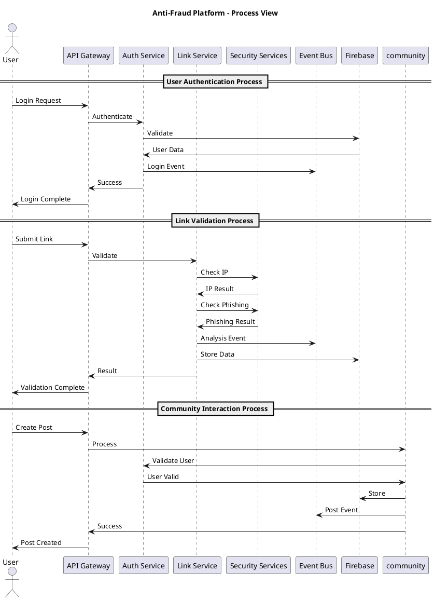
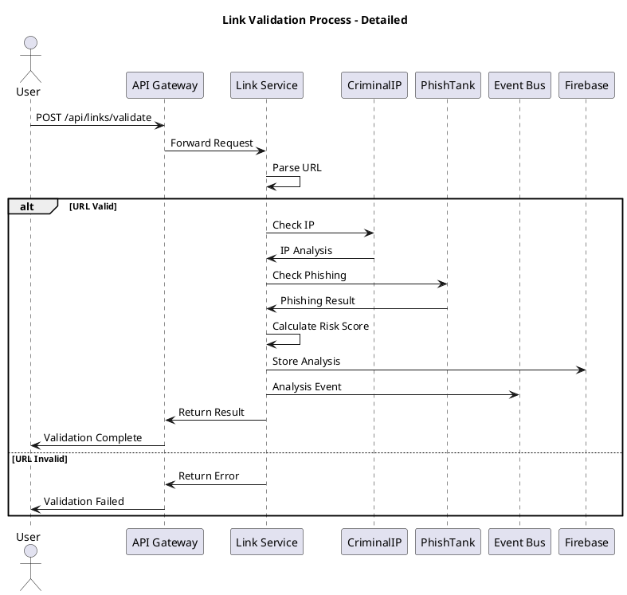
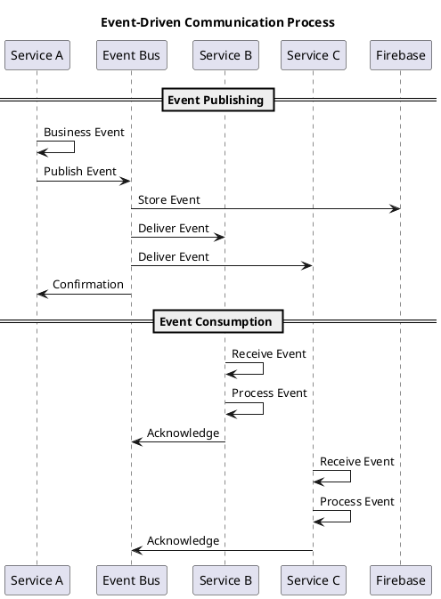
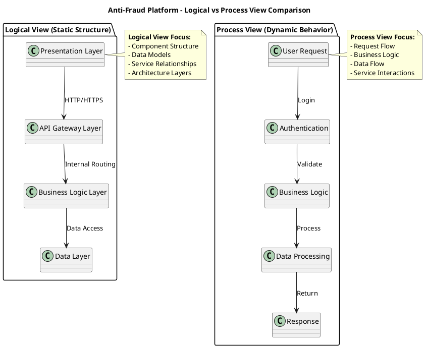

# Sơ Đồ Góc Nhìn Logic và Process - Kiến Trúc Microservices

## 🏗️ Góc Nhìn Logic (Logical View)

### Sơ Đồ Kiến Trúc Logic Tổng Quan

### Sơ Đồ Domain Model Logic

## 🔄 Góc Nhìn Process (Process View)

### Sơ Đồ Process Tổng Quan

### Sơ Đồ Process Chi Tiết - Link Validation

### Sơ Đồ Process Chi Tiết - Event-Driven Communication

## 🎯 Sơ Đồ Tổng Hợp - Logic vs Process

## 📊 Bảng So Sánh Góc Nhìn Logic và Process

| **Aspect** | **Góc Nhìn Logic** | **Góc Nhìn Process** |
|------------|-------------------|---------------------|
| **Mục đích** | Cấu trúc tĩnh và mối quan hệ | Luồng xử lý động và tương tác |
| **Tập trung** | Kiến trúc, domain model | Workflow, business process |
| **Thời gian** | Tĩnh (static) | Động (dynamic) |
| **Thành phần** | Services, components | Actors, processes |
| **Mối quan hệ** | Structural | Behavioral |
| **Sử dụng** | Thiết kế kiến trúc | Business analysis |

## 🔍 Giải Thích Chi Tiết

### 🏗️ Góc Nhìn Logic (Logical View)

**Định nghĩa**: Góc nhìn logic mô tả cấu trúc tĩnh của hệ thống, bao gồm các thành phần, mối quan hệ và tổ chức kiến trúc.

**Đặc điểm chính**:
- **Tĩnh (Static)**: Mô tả cấu trúc tại một thời điểm cụ thể
- **Cấu trúc (Structural)**: Tập trung vào tổ chức và mối quan hệ
- **Kiến trúc (Architectural)**: Thể hiện các layer và component

**Các thành phần chính**:
1. **Presentation Layer**: React SPA, Mobile App, Admin Dashboard
2. **API Gateway Layer**: Kong/Nginx, Express.js Gateway
3. **Business Logic Layer**: Core Services, Security Services, Analytics Services
4. **Data Layer**: Firebase Firestore, Redis Cache, Hadoop HDFS

**Lợi ích**:
- Hiểu rõ cấu trúc hệ thống
- Thiết kế kiến trúc hiệu quả
- Tổ chức code và team
- Phân chia trách nhiệm rõ ràng

### 🔄 Góc Nhìn Process (Process View)

**Định nghĩa**: Góc nhìn process mô tả luồng xử lý động của hệ thống, bao gồm các tương tác, workflow và business logic.

**Đặc điểm chính**:
- **Động (Dynamic)**: Mô tả hành vi theo thời gian
- **Hành vi (Behavioral)**: Tập trung vào tương tác và luồng xử lý
- **Business Logic**: Thể hiện quy trình nghiệp vụ

**Các process chính**:
1. **User Authentication**: Login, validation, session management
2. **Link Validation**: URL parsing, security checks, risk analysis
3. **Community Interaction**: Post creation, user validation, event publishing
4. **Event-Driven Communication**: Event publishing, consumption, acknowledgment

**Lợi ích**:
- Hiểu rõ business logic
- Debug và troubleshoot hiệu quả
- Tối ưu hóa performance
- Phân tích workflow

## 🎯 Kết Luận

### Tại sao cần cả hai góc nhìn?

1. **Bổ sung lẫn nhau**: Logic view cho cấu trúc, Process view cho hành vi
2. **Đối tượng khác nhau**: Developers cần logic view, Business analysts cần process view
3. **Mục đích khác nhau**: Thiết kế vs Phân tích

### Ứng dụng thực tế:

**Góc nhìn Logic**:
- Thiết kế kiến trúc hệ thống
- Tổ chức team và code
- Lập kế hoạch deployment
- Phân chia trách nhiệm

**Góc nhìn Process**:
- Phân tích business requirements
- Debug và troubleshooting
- Performance optimization
- User experience design

Cả hai góc nhìn đều cần thiết để có cái nhìn toàn diện về kiến trúc Microservices, giúp team phát triển hiểu rõ cả cấu trúc và hành vi của hệ thống.
