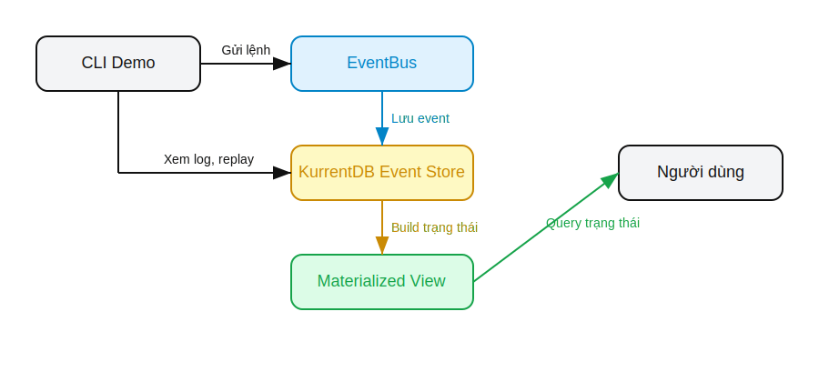

# Demo Event Sourcing trong Project

---

## 1. Kiến trúc Event Sourcing hiện tại

- EventBus publish event
- KurrentDB lưu event (Event Store)
- Materialized View xây dựng trạng thái
- CLI demo tương tác với event store

---

## 2. Sơ đồ kiến trúc demo



---

## 3. Hướng dẫn chạy demo CLI

1. Cài dependencies (nếu cần):
   ```bash
   npm install
   ```
2. Chạy CLI demo:
   ```bash
   node scripts/factcheck-cli.js
   ```
3. Thao tác:
   - Tạo user
   - Update user
   - Xóa user
   - Xem event log
   - Replay event
   - Xem trạng thái hiện tại

---

## 4. Quan sát log event khi chạy project

- Khi chạy các service, mọi event sẽ được log rõ ràng ra console.
- Có thể kiểm tra event log, replay event, kiểm tra trạng thái qua CLI demo.

---

## 5. Checklist demo

- [x] Log event chi tiết khi publish
- [x] CLI demo tương tác
- [x] Xem event log, replay, trạng thái
- [x] Sơ đồ kiến trúc demo
- [x] Slide hướng dẫn demo 